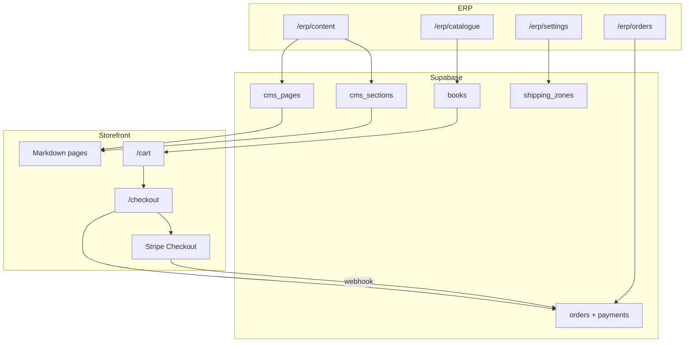

# DSB production site: CMS + commerce + institutional

**Status:** Approved plan (saved) — ready for implementation  
**Date:** 2026-08-06  

Client requirement: **every public front page is editable from the ERP**, plus institutional About content, founder biography, and **live international checkout** (not enquiry-only). Build on existing Next.js 16 / Supabase / ERP orders ledger.

---

## Implementation todos

1. Migrations for `cms_pages`, `cms_sections`, `enquiries.topic`, `shipping_zones`, commerce settings; seed all public pages + founder placeholder  
2. ERP Content module (`/erp/content`) — list/edit/preview/publish Markdown pages + home sections; nav + RLS + audit  
3. Shared storefront layout, header (desktop+mobile), footer, skip link, typography plugin  
4. Markdown renderer + dynamic About/legal/visit/enquiry/home copy from CMS; fallbacks if unpublished  
5. `metadataBase`, OG, sitemap/robots, JSON-LD, public meta voice, favicon  
6. Cart provider, `/cart`, `/checkout`, stock checks, pickup/domestic/international fulfillment  
7. Stripe Checkout + webhook → online orders/payments/stock; ERP order channel online  
8. ERP shipping zones, FX/Stripe flags, international fee defaults in Settings  
9. Enquiry topic select, honeypot, Zod, deep-links; ERP topic badge  
10. Authors on tiles, related books, loading skeletons, home strips from CMS  
11. Full QA matrix (CMS edit→publish→storefront, checkout happy path), lint/build, PR  

---

## 1. Locked decisions

| Topic | Decision |
|---|---|
| Page editing | **ERP Content CMS** — Markdown (+ SEO fields) in Supabase; storefront renders published rows |
| What “every front page” means | Home sections, all About pages (incl. founder), Visit intro, Enquiry intro, Privacy, Terms — **plus** books/authors already via Catalogue |
| Founder bio | Seeded institutional placeholder in CMS page `about/founder`; staff replace text in ERP (no invented personal names in seed) |
| Format | GitHub-flavored **Markdown** in `body_md`; safe render via `react-markdown` + `remark-gfm` + sanitization |
| Blocks | Optional `cms_sections` for Home (hero, about strip, visit strip, featured heading) — keyed slots, not a freeform page builder |
| International pay | **Stripe Checkout** (card) for `fulfillment_type = international` and optional domestic card |
| Local pay | **COD** + **bank transfer / QR** (manual confirm in ERP) for pickup & Bhutan delivery |
| Currency | Catalogue remains **BTN**; Stripe charges **USD** using owner-configurable `btn_per_usd` in settings (shown on checkout) |
| Shipping | ERP-editable `shipping_zones` (pickup / bhutan / international) with fee BTN + notes |
| Nav structure | Code-defined routes; **page titles/bodies** from CMS (nav labels stay stable) |
| Out of scope still | Customer accounts/wishlists, email provider polish beyond order confirmation page, analytics, collections public UI (schema exists — defer unless needed) |

---

## 2. Architecture



---

## 3. CMS data model

### `cms_pages`

| Column | Notes |
|---|---|
| `id`, `slug` (unique) | e.g. `about`, `about/founder`, `privacy`, `terms`, `visit`, `enquiry` |
| `title`, `nav_label` | Display |
| `subtitle` | Lead under H1 |
| `body_md` | Full Markdown |
| `seo_title`, `seo_description` | |
| `hero_public_id` | Optional Cloudinary |
| `template` | `hub` \| `article` \| `legal` \| `simple` |
| `show_enquire_cta`, `enquire_topic` | |
| `is_published`, `sort_order`, `updated_at`, `updated_by` | |

### `cms_sections`

Keyed slots for Home (and future): `home.hero.eyebrow`, `home.hero.headline`, `home.hero.support`, `home.hero.cta_primary_label`, `home.about.*`, `home.visit.*`, `home.shelf.heading` — each `key`, `label`, `value_md` or `value_text`, `is_published`.

### Seed (migration)

Insert all About hub + 8 children (client service bullets as Markdown lists), Privacy/Terms (migrate current static copy), Visit/Enquiry intros, Home sections. Founder page: family-bookstore lineage copy **without personal names** + ERP note in description “Replace with founder biography.”

### RLS

- Public: `SELECT` where `is_published = true`
- Staff: full write (`is_staff()`); match books pattern
- Audit on publish/update via existing `audit_logs`

---

## 4. ERP Content module (required)

New nav item **Content** (manager+): `src/components/erp/nav.ts`

| Route | Purpose |
|---|---|
| `/erp/content` | Table of pages: title, slug, published, updated |
| `/erp/content/[id]` | Edit title, SEO, Markdown textarea, template, CTA flags, publish toggle |
| `/erp/content/home` | Edit home section slots |
| Preview | “View live” link opens storefront slug in new tab |

UX details:

- Markdown toolbar minimal (bold/heading/list hints) — textarea first; live preview pane side-by-side on desktop
- Unpublish hides from storefront (404 or fallback message for required pages like privacy — required pages cannot unpublish, only edit)
- Role: manager + owner edit; staff read-only optional

Server actions: `upsertCmsPage`, `upsertCmsSection`, `toggleCmsPublish` in `src/lib/erp/actions.ts`.

---

## 5. Storefront rendering from CMS

- `src/lib/cms/get-page.ts` — fetch by slug; `notFound` if missing/unpublished
- `src/components/storefront/markdown-body.tsx` — styled `prose` + GFM
- Routes:
  - `/about` ← `cms_pages.slug = about` (hub template lists child pages by `slug like about/%` sort_order)
  - `/about/[slug]` ← `about/{slug}`
  - `/privacy`, `/terms`, `/visit` intro, `/enquiry` intro ← CMS
  - Home hero/strips ← `cms_sections`
- **Books / authors / catalogue** remain Catalogue ERP (already editable) — Content module does not duplicate PIM
- Shared chrome still from layout (header/footer code); footer “About” links derived from published about pages

About IA (CMS-seeded slugs):

```
about
about/founder
about/publications
about/bhutan-australia
about/schools-universities-libraries
about/digital-knowledge-lab
about/earth-community
about/partner
about/international-orders
```

Service bullets from the client brief live in the relevant page `body_md` so staff can edit wording anytime.

---

## 6. Ecommerce + international checkout

### Storefront

- Cart: React context + cookie (`dsb_cart`) — `{ bookId, qty }[]`
- `/cart` — lines, qty, remove, subtotal BTN, stock badge
- `/checkout` — contact, fulfillment:
  - **Pickup** Thimphu (fee 0)
  - **Bhutan delivery** (zone fee)
  - **International** (zone fee + address fields: name, line1, city, country, postcode)
- Payment choice:
  - Pickup/Bhutan: COD | Bank transfer | Card (Stripe)
  - International: **Card (Stripe) required**
- Order creates `orders` row `channel = 'online'`, line items, `shipping_address` jsonb, pending payment
- Stripe Checkout Session with metadata `order_id`; success `/checkout/success?order=…`, cancel back to cart
- Webhook `/api/stripe/webhook`: mark payment `paid`, order `paid`/`confirmed`, stock `sale_out` movements (idempotent)
- COD/bank: order `cod_pending`; staff confirm in ERP Orders (existing payment helpers extended)

### ERP commerce settings

Extend `store_settings` / Settings UI:

- `online_checkout_enabled` bool
- `btn_per_usd` numeric
- `stripe_enabled` bool (keys in env only)

### `shipping_zones` table

`code`, `label`, `fee_btn`, `is_active`, `notes_md` — editable under Settings or `/erp/shipping`.

### Book detail CTA

Primary: **Add to cart** when `online_checkout_enabled` && in stock; secondary Enquire. Out of stock → Enquire only.

### Honesty / AI-critique

Checkout copy states: international ships after payment confirmation; timelines by reply/ERP; prices BTN with USD charge explanation at Stripe step. No fake “arrives in 3 days” claims.

Env additions (`.env.example`):

```
STRIPE_SECRET_KEY=
NEXT_PUBLIC_STRIPE_PUBLISHABLE_KEY=
STRIPE_WEBHOOK_SECRET=
```

---

## 7. Storefront chrome, SEO, enquiry (still required)

- Shared `(storefront)/layout` + mobile Sheet header + footer + skip link + `<main>`
- `metadataBase`, OG, sitemap (include CMS slugs + books), robots disallow `/erp`, JSON-LD
- Enquiry topics + honeypot + `enquiries.topic` + ERP badge
- Catalogue polish: authors on tiles, related books, `loading.tsx`
- Public root description without “ERP”

---

## 8. Desktop / mobile templates

- **CMS article**: breadcrumb + Markdown prose + optional Enquire CTA from page flags
- **Cart/Checkout**: single-column mobile; two-column summary sticky on desktop
- **ERP Content editor**: split preview hidden on small screens (edit-first)
- Desktop nav: Catalogue · Authors · About · Visit · Enquire (+ Cart when commerce on)
- Mobile: hamburger Sheet with About children listed

---

## 9. Implementation order

1. Migrations: CMS tables + seed pages/sections + `enquiries.topic` + shipping_zones + settings columns  
2. ERP Content module (list/edit/publish) + nav  
3. Markdown renderer + wire About/legal/visit/enquiry/home to CMS  
4. Storefront chrome + SEO pack  
5. Cart + checkout UI + order creation  
6. Stripe session + webhook + stock decrement  
7. ERP shipping/FX settings + online order visibility in Orders  
8. Enquiry topics + catalogue/home polish  
9. QA: edit page in ERP → appears on site; place international test order in Stripe test mode  

---

## 10. Acceptance (ChatGPT-proof)

- [ ] Staff can change founder Markdown in ERP and see it on `/about/founder` after publish  
- [ ] Every marketing URL above is CMS-backed (no hardcoded story paragraphs left in page files except thin routers)  
- [ ] Privacy/Terms editable; always published  
- [ ] International checkout charges via Stripe test card; order shows in `/erp/orders` as online  
- [ ] COD pickup order appears without Stripe  
- [ ] Unpublishing a non-required About child removes it from hub + sitemap  
- [ ] Mobile nav, footer legal links, sitemap, JSON-LD present  
- [ ] No “ERP” in public meta; no invented founder identity in seed  

---

## 11. Risk notes (handled in design)

- **Stripe + BTN:** FX rate owner-controlled; receipt shows BTN equivalent in order notes  
- **Webhook reliability:** idempotent payment reference = Stripe session/intent id  
- **CMS XSS:** Markdown → React components only; no raw `dangerouslySetInnerHTML` for untrusted HTML  
- **Required pages:** privacy/terms/about hub cannot be deleted (DB check or UI lock)
